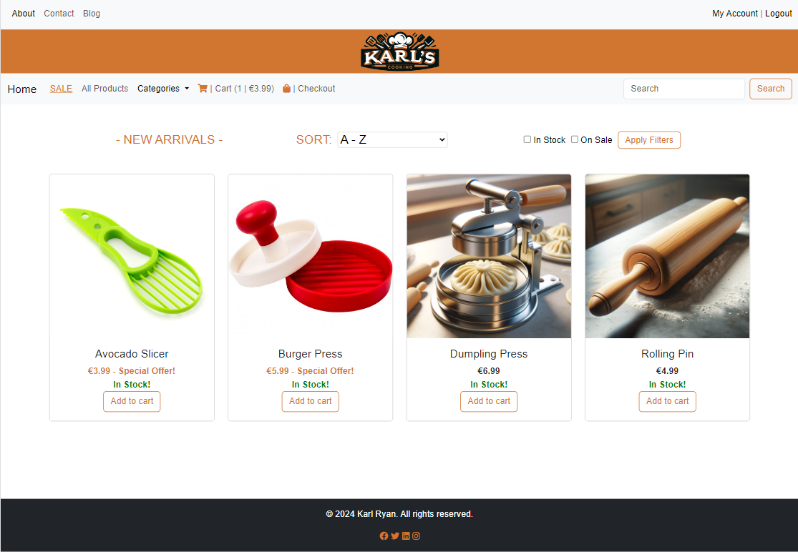
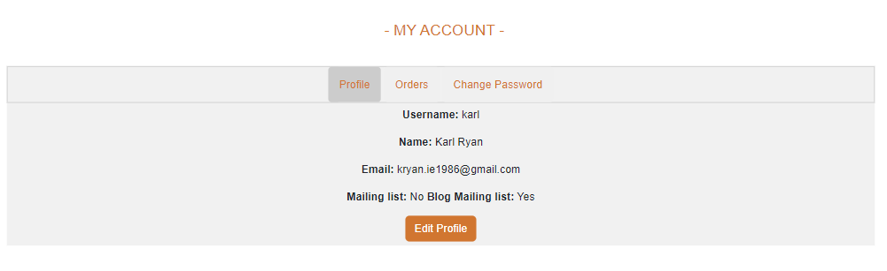
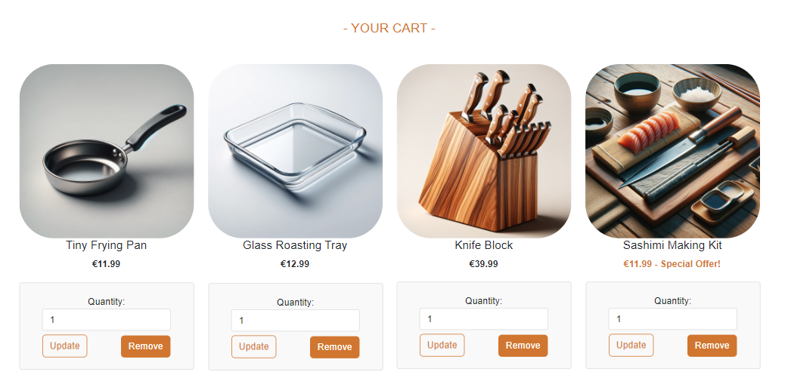
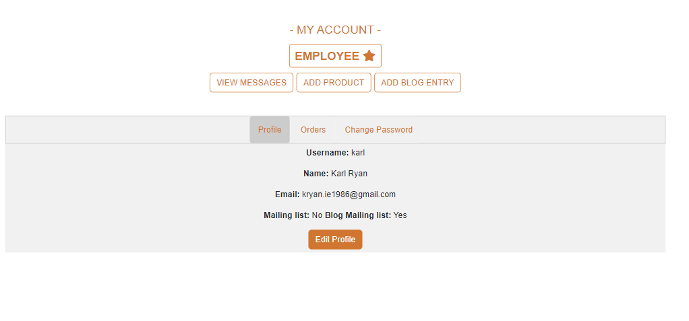
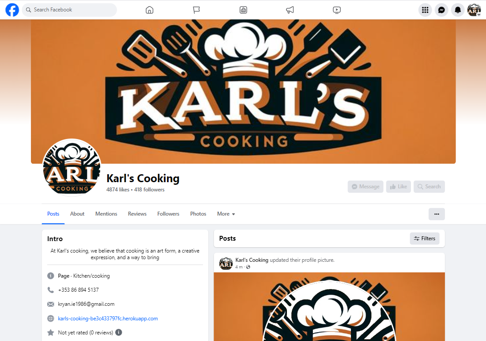
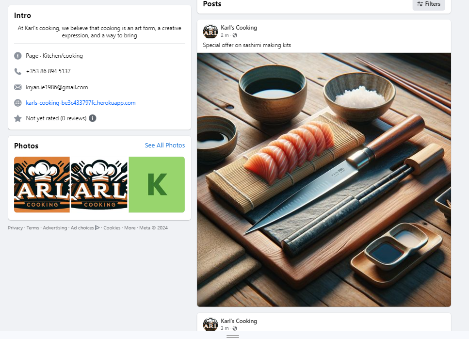
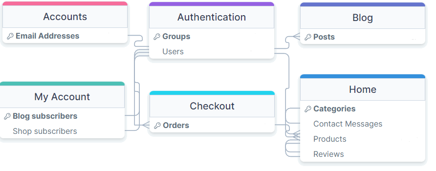

# Karl's Cooking

Welcome to Karl's Cooking, your ultimate destination for transforming your culinary dreams into reality! Here, we believe that the heart of every home beats in the kitchen, and our mission is to equip you with the finest tools, gadgets, and supplies to make every meal a masterpiece. Whether you're a seasoned chef or just beginning your culinary journey, Karl's Cooking offers an unparalleled selection of high-quality, innovative products designed to inspire creativity, enhance flavors, and simplify your cooking process. Dive into our world, where cooking is not just an activity but an adventure waiting to unfold in every dish you create.

## Features

- **Online Store**: Various categories that users can browse through, sort, filter, and a seperate page that only contains items on special offer.

- **Account Management**: Users are able to register for accounts. Inside profile, users can see and change their information as well as orders placed.

- **Blog**: There's a seperate blog section where users can see blog posts detailing recipes.

- **Cart/Checkout**: Users are able to add items to cart, modify existing carts and ultimately check out to complete their purchase.

- **Staff Controls**: Admins and employees are treated to a slightly different experience. Extra buttons and controls are added, detailed below.

Users will be able to browse, view and select various cookware items. Items have detailed descriptions. Users will also be able to browse a paginated list of blog posts that contain recipes for cooking.

## Design

### Fonts:
Standard fonts are used throughout the site, plans to investigate better fonts.

### Images:
Icons have been created personally, using Dall-e 3.

### Logo/Favicon:
Designed using paint.net and Dall-e 3.

### Colour Scheme:

The colour scheme is based on the logo. The logo went through several designs before I settled on the orange and black colour used throughout the site.

### User Suggestions:
* I would like to be able add favorite items.
  * This is to be implemented before release.
* I would like to change or remove my account.
  * Allauth handles account management.
* I would like to have the option for multi buy savings.
  * Would be good to implement if time permits.
* I want to be able to see user reviews.
  * This is to be implemented before release.
* I would like to be able to subscribe for perishable products like oils and spices.
  * Currently there is no plans to include perishables or subscriptions but could be implemented in future.
* I would like to look at cooking recipes.
  * A blog has been implemented.

### Staff Controls:
The website has lots of controls for staff allowing them to make changes to the site and have CRUD functionality. Some examples are:
* The account page has an employee flag, as well as buttons for:
  * Viewing messages
  * Adding products to the store
  * Adding an entry to the blog
* Individual product pages have an edit button
* The blog page has a button to create an article
* Individual articles have an edit button

## Technologies Used
- **Frontend**: HTML, CSS, JavaScript
- **Backend**: Django (Python)
- **Database**: ElephantSQL
- **Payment Service**: Stripe

### Libraries Used
- FontAwesome
- Bootstrap
- Cloudinary
- Django

## Testing
### Validation
* HTML tested with W3C HTML5 Validator every day.
* CSS has been validated with W3C CSS Validator every day or major change.
* Tested against PEP8 validation for compliance. Several errors around indentation found but these were minor and corrected easily.

### External Testing
* My code was sent to friends and family for feedback and testing.
* All user input is error checked to prevent improper input from the user.
* As the site was built using a Windows 11 PC, the majority of the testing was done using this machine and VS Code on gitpod, as well as on Heroku.

#### Internal Testing / Bugs found
Code was mostly tested on VS Code and PythonTutor with regular PEP8 checks.

#### Item Creation
* Staff were able to create product items that had negative values, leading to potentially negative value orders or severely reduced total prices, which in turn could severely hamper revenue. This was corrected by adding a simple check to the form that will disallow values below zero.

#### Database
* Database was initially set up incorrectly and items were using strange tags. By investigating ElephantSQL I was able to see the proper terms to be used in the site, especially in relation to images on the blog.
* When attempting to create a one to one field for newsletter subscription, I would get an AttributeError. This was resolved by updating the UserProfile model, which led to - 
* When attempting to access the subscription list I got a FieldError. This was resolved by changing admin.py to filter correctly.

#### Store
* Users are able to sort and filter but the 'on sale' filter does not work. This will be investigated and resolved before release.
* Some of the cards in the store are different sizes, this will be fixed before release.
* The footer was not locked to the bottom of the page regardless of settings. This was caused by a conflict with bootstrap and was resolved using CSS.
* The product cards would redirect to the item page, even if the add to cart button was pressed. The error was, the URL tag was wrapped around the whole card. I moved it to only wrap around the image only.
* The 'on sale' and 'in stock' flags stopped working inexplicably. I updated the form with an action that might have been removed accidentally and it worked again.

#### Redirects
* The user is currently being redirected to the cart regardless of intent, when adding an item to the cart. This is also preventing toasts from displaying. While not critical, this should be rectified before release.

#### JavaScript
* JavaScript is used in several locations but in the account page it controls the tabs. As this was in the main script.js file it would give a null error and prevent script in other pages. This was resolved by removing the script entirely and moving it to a seperate file that is only called by the account page.

#### Checkout
* Upon getting an error that seemed to cycle between TypeError and UnboundLocalError I had to completely remove the cart - checkout apps and start fresh several times.
* Checkout would not pass the cart contents to the payment page. This was resolved by updating the method to pull from session data.
* Incorrect information was passed to the success page. This was resolved by changing the template to reflect the changes made above.
* Guest users were unable to check out, instead getting an AttributeError 'NoneType' object has no attribute 'email'. The issue was I was attempting to create an instance of the order model and pass email, but there was no user being assocuated with the order. The code was attempting to access this information from the shipping address. Code needed to be updated to handle situations where order.user was None so that guests can check out.

#### Cosmetics
* Anywhere using a form would automatically inherit from bootstrap, this was evident when there was only one button, for example 'log out' or 'add to cart'. Custom CSS styling was nesessary.

#### Security Testing
* I also identified that users could:
    * Access edit pages while not logged in
    * Manipulate the URL to force account viewing without an account
    * Manually create blog entries

* These were fixed by adding various checks. Using django conditionals, users are now redirected to the homepage, denied page or 404 page when attempting to access pages they're not supposed to.

#### Registration
* Users were initially unable to register for accounts due to emails not being sent out. This was initially caused by an oversight where I accidentally left the email backend to console. This was a quick fix, changing the email backend to django.core.mail.backends.smtp.EmailBackend and populating the settings accordingly, but this led to a large string of errors:

* The first step was to input the correct configurations into settings.py but this did not help. This led to a 'network unreachable' error when attempted on Gitpod, and due to an unrelated error, detailed later, I was unable to test in Heroku.

* Somewhat related, there seemed to be a software incompatibility somewhere with the versons of Django, Allauth, ElephantSQL and Heroku. After lots of trial and error, mostly error, I failed to identify a direct fix for the problem. Eventually I gave up and updated all installed plugins to their latest version, which led to a follow on error:

* My ElephantSQL database was version 11 which is incompatible with newer versions of Django. When I first started developing the site, I simply rolled back the version of Django installed, but this was no longer an option as I needed the newer version for email compatibility. As ElephantSQL is now reaching end of life they were not willing to even offer me a paid alternative. Aiven offer a similar free service too so I just needed to migrate the database there and update environment variables.

* When I attempted to launch in Heroku I was given an application error preventing the site from launching. Checking the logs, it seemed that there was an unterminated string literal in home.models preventing the site from launching. This was resolved after a brief investigation but I can't recall changing this file since deployment, leading me to believe that this may have been automatically changed by a linter or was always an issue but was ignored with the previous plugin versions.

* When this was repaired, the site launched fine but led to another error when attempting to test email sending: an authentication error. This was an easy fix; I just needed to update the email password in Heroku environment variables.

#### Development environment
* It seemed that the development URL was changing randomly and needed to be updated constantly. If encountering an error, ensure that the url is added to allowed hosts in settings.py.

## Marketing

### Facebook Business Page
* A business page was created on Facebook to promote the site:

* The business page is updated with posts showing special offers or new arrivals:

### Search Engine Optimisation
* There are included meta tags in base.html to improve SEO.
* The site is styled for mobile compatibility.
* URLs are designed with relevant titles for ease of search.
* Long form blog entries to attract users looking for recipes.
* Sitemap.xml and robots.txt included in project.

### Business Model
Business model can be found [here](https://github.com/Karl-Ryan0/Portfolio-5/blob/main/business_model.md).

## Database Schema

## Deployment
1. Navigate to [https://github.com/Karl-Ryan0/Portfolio-5](https://github.com/Karl-Ryan0/Portfolio-5).
2. You can set up your own repository and copy or clone it, or you fork the repository.
3. `git add`, `git commit` and `git push` to a GitHub repository, if necessary.
4. GitHub pages will update from the master branch by default.
5. Go to the **Settings** page of the repository.
6. Scroll down to the **Github Pages** section.
7. Select the Master Branch as the source and **Confirm** the selection.
8. Wait a minute or two and it should be live for viewing.

## Deployment to Heroku

### Prerequisites

* Heroku Account
* Heroku CLI
* Git

### Steps

#### Login to Heroku:

Open a terminal or command prompt and log in to Heroku using the following command:

`heroku login`

#### Navigate to Your Project Directory:

Use the terminal or command prompt to navigate to your Django project directory.
Create a New Heroku App: Run the following command to create a new Heroku app:

`heroku create karls-cooking`

#### Set the Buildpack:

Heroku needs to know how to build your Django project. Set the buildpack to Python by running:

`heroku buildpacks:set heroku/python`

#### Add PostgreSQL Addon:

Heroku provides a PostgreSQL database for your app. Add it using the following command:

`heroku addons:create heroku-postgresql:hobby-dev`

#### Commit Changes to Git:

If your project is not already a Git repository, initialize it with git init. Then, add all files and commit changes:

`git add .`

`git commit -m "Initial commit"`

#### Push to Heroku:
Deploy your application to Heroku by pushing your code to the Heroku remote repository:

`git push heroku master`

#### Run Migrations:
After deployment, run any pending migrations on your Heroku PostgreSQL database:

`heroku run python manage.py migrate`

#### Set Environment Variables:
The project uses environment variables that won't be carried over. They should be added using the Heroku CLI or through the Heroku Dashboard.

#### Open Your App:
Once the deployment process is complete, open your app in the browser using:

`heroku open`

#### Monitor Logs:
You can monitor your application's logs to debug any issues using:

`heroku logs --tail`

The application should now be running on Heroku.

#### Additional Resources
* [Heroku Dev Center](https://devcenter.heroku.com/)
* [Deploying Python and Django Apps on Heroku](https://karls-cooking-be3c433797fc.herokuapp.com/)
* [Heroku PostgreSQL Documentation](https://devcenter.heroku.com/articles/heroku-postgresql)

Live link can be found [here](https://karls-cooking-be3c433797fc.herokuapp.com/).

## Credits
* Django backend
* Bootstrap
* FontAwesome
* All code was freehand however additional thanks for the people at Mammoth Interactive and CI for the great tutorials.
* Images on this readme are my own screenshots.