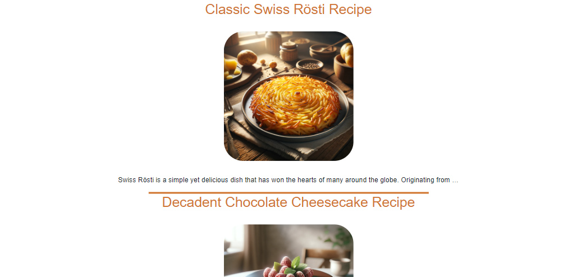
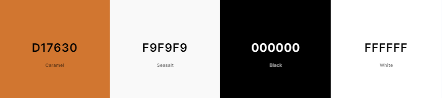

# Karl's Cooking

Welcome to Karl's Cooking, your ultimate destination for transforming your culinary dreams into reality! Here, we believe that the heart of every home beats in the kitchen, and our mission is to equip you with the finest tools, gadgets, and supplies to make every meal a masterpiece. Whether you're a seasoned chef or just beginning your culinary journey, Karl's Cooking offers an unparalleled selection of high-quality, innovative products designed to inspire creativity, enhance flavors, and simplify your cooking process. Dive into our world, where cooking is not just an activity but an adventure waiting to unfold in every dish you create.

## Features

- **Online Store**: Various categories that users can browse through, sort, filter, and a seperate page that only contains items on special offer.

- **Account Management**: Users are able to register for accounts. Inside profile, users can see and change their information as well as orders placed.

- **Blog**: There's a seperate blog section where users can see blog posts detailing recipes.

- **Cart/Checkout**: Users are able to add items to cart, modify existing carts and ultimately check out to complete their purchase.

- **Staff Controls**: Admins and employees are treated to a slightly different experience. Extra buttons and controls are added, detailed below.

Users will be able to browse, view and select various cookware items. Items have detailed descriptions. Users will also be able to browse a paginated list of blog posts that contain recipes for cooking.

## Design

### Fonts:
Standard fonts are used throughout the site, plans to investigate better fonts.

### Images:
Icons have been created personally, using Dall-e 3.

### Logo/Favicon:
Designed using paint.net and Dall-e 3.

### Colour Scheme:

The colour scheme is based on the logo. The logo went through several designs before I settled on the orange and black colour used throughout the site.

### User Suggestions:
* I would like to be able add favorite items.
  * This is to be implemented before release.
* I would like to change or remove my account.
  * Allauth handles account management.
* I would like to have the option for multi buy savings.
  * Would be good to implement if time permits.
* I want to be able to see user reviews.
  * This is to be implemented before release.
* I would like to be able to subscribe for perishable products like oils and spices.
  * Currently there is no plans to include perishables or subscriptions but could be implemented in future.
* I would like to look at cooking recipes.
  * A blog has been implemented.

### Staff Controls:
The website has lots of controls for staff allowing them to make changes to the site and have CRUD functionality. Some examples are:
* The account page has an employee flag, as well as buttons for:
  * Viewing messages
  * Adding products to the store
  * Adding an entry to the blog
* Individual product pages have an edit button
* The blog page has a button to create an article
* Individual articles have an edit button

## Technologies Used
- **Frontend**: HTML, CSS, JavaScript
- **Backend**: Django (Python)
- **Database**: ElephantSQL
- **Payment Service**: Stripe

### Libraries Used
- FontAwesome
- Bootstrap
- Cloudinary
- Django

## Testing
### Validation
* HTML tested with W3C HTML5 Validator every day.
* CSS has been validated with W3C CSS Validator every day or major change.
* Tested against PEP8 validation for compliance. Several errors around indentation found but these were minor and corrected easily.

### External Testing
* My code was sent to friends and family for feedback and testing.
* All user input is error checked to prevent improper input from the user.
* As the site was built using a Windows 11 PC, the majority of the testing was done using this machine and VS Code on gitpod, as well as on Heroku.

### Internal Testing / Bugs found
Code was mostly tested on VS Code and PythonTutor with regular PEP8 checks.

### Database
* Database was initially set up incorrectly and items were using strange tags. By investigating ElephantSQL I was able to see the proper terms to be used in the site, especially in relation to images on the blog.
* When attempting to create a one to one field for newsletter subscription, I would get an AttributeError. This was resolved by updating the UserProfile model, which led to - 
* When attempting to access the subscription list I got a FieldError. This was resolved by changing admin.py to filter correctly.

### Store
* Users are able to sort and filter but the 'on sale' filter does not work. This will be investigated and resolved before release.
* Some of the cards in the store are different sizes, this will be fixed before release.
* The footer was not locked to the bottom of the page regardless of settings. This was caused by a conflict with bootstrap and was resolved using CSS.
* The product cards would redirect to the item page, even if the add to cart button was pressed. The error was, the URL tag was wrapped around the whole card. I moved it to only wrap around the image only.

### Redirects
* The user is currently being redirected to the cart regardless of intent, when adding an item to the cart. This is also preventing toasts from displaying. While not critical, this should be rectified before release.

### JavaScript
* JavaScript is used in several locations but in the account page it controls the tabs. As this was in the main script.js file it would give a null error and prevent script in other pages. This was resolved by removing the script entirely and moving it to a seperate file that is only called by the account page.

### Automated Testing
* There was little need for automated testing although I did need some to send mock locations as I was unable to travel to test accuracy.

* I did add automated tests for deleting other user's locations using URL manipulation as I couldn't figure out the exact URL needed.

### Security Testing
* I also identified that users could:
    * Access edit pages while not logged in
    * Manipulate the URL to force account viewing without an account
    * Manually create blog entries

* These were fixed by adding various checks. Using django conditionals, users are now redirected to the homepage, denied page or 404 page when attempting to access pages they're not supposed to.

## Marketing

### Facebook Business Page
* A business page was created on Facebook to promote the site:

* The business page is updated with posts showing special offers or new arrivals:

### Search Engine Optimisation
There are included meta tags in base.html to improve SEO.

### Business Model
Business model can be found [here](https://github.com/Karl-Ryan0/Portfolio-5/blob/main/business_model.md).

<!-- ## Database Schema
 -->

## Deployment
1. Navigate to [https://github.com/Karl-Ryan0/Portfolio-5](https://github.com/Karl-Ryan0/Portfolio-5).
2. You can set up your own repository and copy or clone it, or you fork the repository.
3. `git add`, `git commit` and `git push` to a GitHub repository, if necessary.
4. GitHub pages will update from the master branch by default.
5. Go to the **Settings** page of the repository.
6. Scroll down to the **Github Pages** section.
7. Select the Master Branch as the source and **Confirm** the selection.
8. Wait a minute or two and it should be live for viewing.

Live link can be found [here](https://karls-cooking-be3c433797fc.herokuapp.com/).

## Credits
* Django backend
* Bootstrap
* FontAwesome
* All code was freehand however additional thanks for the people at Mammoth Interactive and CI for the great tutorials.
* Images on this readme are my own screenshots.